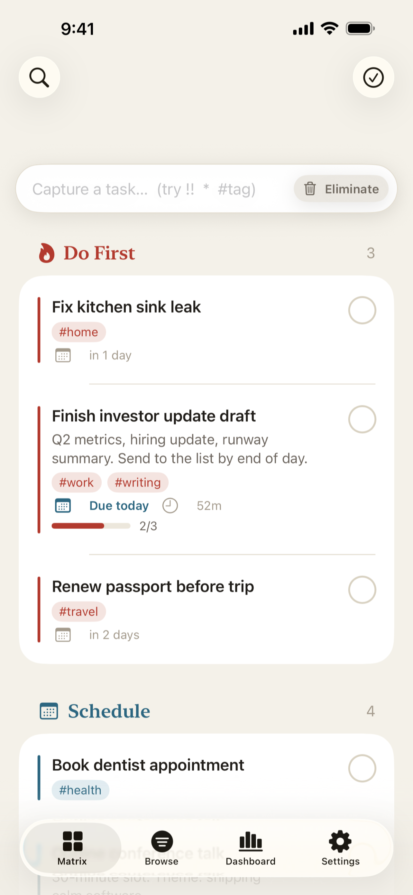

# GSD — Get Stuff Done

A **privacy-first, offline-first Eisenhower-matrix task manager** for iPhone, iPad, and Mac — a native SwiftUI rebuild of the [GSD web app](https://gsdtaskmanager.com/).

Every task is framed on two axes — *urgent* and *important* — and sorted into one of four quadrants (**do first · schedule · delegate · eliminate**), so the app answers one question well: *what do I work on next?*

<p align="center">
  
</p>

## Principles

- **Privacy is the product, not a setting.** All data lives on-device. The app is fully usable with **no account and no network** — cloud sync is strictly optional and opt-in.
- **Depth under a calm surface.** The 2×2 grid stays simple; recurrence, dependencies, time tracking, analytics, and sync live one layer down.
- **Native, not ported.** Built around iOS idioms — swipe actions, context menus, drag-and-drop, widgets, App Intents, `NavigationSplitView` — with iPhone and iPad as co-equal targets.

## Features

Natural-language capture parser (`!`, `!!`, `*`, `#tag`), recurrence, subtasks, dependency graphs, time tracking, snooze, archive, smart views, search, a ⌘K command palette, an analytics dashboard, import/export, and local notifications — plus native surfaces a web view can't deliver: Home/Lock-Screen **widgets**, **App Intents / Siri / Shortcuts**, a **Share Extension**, and **Spotlight**. Optional bidirectional sync runs against a [PocketBase](https://pocketbase.io/) backend, shared with the web app.

## Architecture

All testable logic lives in a layered Swift package (`GSDKit/`); the app and its two extensions are thin SwiftUI/host shells on top. The dependency direction is enforced by the package manifests:

| Module | Responsibility | Depends on |
|---|---|---|
| **`GSDModel`** | Pure domain — `Task`, `Quadrant`, capture parser, recurrence, dependency graph, filtering, validation, analytics, import/export | _nothing_ |
| **`GSDStore`** | [GRDB](https://github.com/groue/GRDB.swift) persistence — `AppDatabase` + migrations, repositories over `ValueObservation`, the `@Observable TaskStore` (single mutation path) | GSDModel + GRDB |
| **`GSDSync`** | Foundation-only PocketBase REST + SSE sync — a pure `actor SyncEngine` (pull / push / last-write-wins), OAuth2-PKCE auth | GSDModel + GSDStore |
| **`GSDSnapshot`** | GRDB-free app↔extension contract — `WidgetSnapshot`, Share-Extension outbox, `gsd://` deep links | GSDModel only |

The **app** (`App/`) is SwiftUI organized by feature folder. **Extensions** (`Widgets/`, `ShareExtension/`) are GRDB-free and talk to the app through `GSDSnapshot` + a shared App Group.

```
GSDKit/   Swift package — all testable logic (model, store, sync, snapshot)
App/      SwiftUI app, organized by feature (Matrix, Editor, Browse, Dashboard, Sync, …)
Widgets/  WidgetKit extension
ShareExtension/  Share-sheet target
docs/     Per-phase specs and implementation plans
```

## Building

The Xcode project is **generated** from `project.yml` with [XcodeGen](https://github.com/yonaskolb/XcodeGen) — never hand-edit `GSD.xcodeproj` or `App/Info.plist`.

```bash
# Fast feedback loop — pure logic, no simulator, no backend (sub-second):
cd GSDKit && swift test

# Generate the Xcode project, then build for a simulator:
xcodegen generate
xcodebuild -project GSD.xcodeproj -scheme GSD \
  -destination 'platform=iOS Simulator,name=iPhone 17 Pro' build
```

The app also ships on iPad and Mac Catalyst — build all three before considering UI work done (see [`CLAUDE.md`](CLAUDE.md) for the iPad and Catalyst destinations).

**Requirements:** Xcode for iOS 26.0+, Swift 6.0 (strict concurrency on), and `xcodegen` on your `PATH`.

## Project layout & conventions

- **`PRODUCT.md`** — product purpose, brand, and design principles.
- **`spec.md`** — the full behavior specification (the authority).
- **`coding-standards.md`** — the full coding reference; **`CLAUDE.md`** covers only what's project-specific.
- **`docs/specs/`** and **`docs/superpowers/plans/`** — per-phase specs and implementation plans.

## License

[MIT](LICENSE) © 2026 Vinny Carpenter
